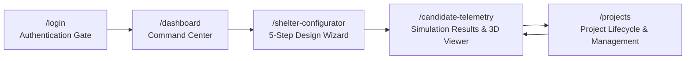
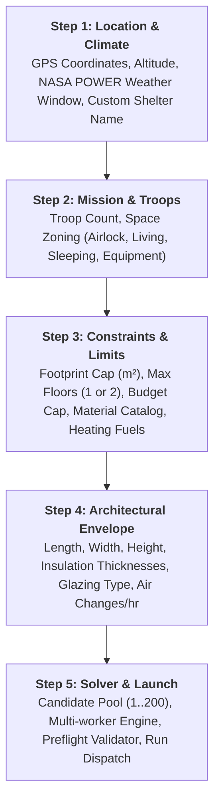

# COCOON: Platform Architecture & Live Presentation Guide
**MIL-PRF-32535 Thermal Decision & Generative Shelter Engineering Platform**

---

## 1. Executive Summary & Problem Context

In extreme high-altitude military sectors (such as **Siachen Glacier at 5,400m AMSL** and **Daulat Beg Oldie at 5,065m AMSL**), ambient temperatures plummet to **-40°C** with high winds and extreme solar irradiation fluctuations. Traditional expeditionary shelters rely heavily on fossil fuels (Kerosene / SKO), resulting in massive resupply logistics, high lifecycle costs, and severe carbon footprints.

**COCOON** is an end-to-end computational design and physics-simulation platform that:
1. **Synthesizes generative architectural configurations** tailored to extreme high-altitude micro-climates.
2. **Solves transient thermal heat transfer equations** across multi-zone building layouts using coupled RC (Resistance-Capacitance) network solvers.
3. **Computes multi-objective Pareto optimization** across thermal comfort, structural mass, capital cost (CapEx), and 20-year lifecycle logistics costs (LCC).
4. **Validates 3D structural geometry and CFD/FEM thermal models** via automated FEA pipelines.

---

## 2. Screen-by-Screen Live Walkthrough & Presentation Script

This guide is organized so you can present the project screen-by-screen while demonstrating the live website.



---

### Screen 1: Secure Authentication Gateway (`/login`)

```
+-------------------------------------------------------------+
|                      [ COCOON BRAND ]                       |
|           Thermal Shelter Design & Simulation               |
|                                                             |
|  +-------------------------------------------------------+  |
|  |                       Sign In                         |  |
|  |  Email:    [ commander.ladakh@drdo.nic.in          ]  |  |
|  |  Password: [ •••••••••••••••••                     ]  |  |
|  |                                                       |  |
|  |  [           AUTHENTICATE & ENTER WORKSTATION        ] |  |
|  |                                                       |  |
|  |  ----------------------- OR ------------------------  |  |
|  |  [               ⚡ 1-Click Demo Login               ] |  |
|  +-------------------------------------------------------+  |
+-------------------------------------------------------------+
```

#### What you show on screen:
- A clean, modern authentication portal with pre-populated credentials or 1-click instant login.
- Multilingual language switcher (English / Hindi) in the top-right corner.

#### What to say to your audience:
> *"We begin at the Secure Access Gate. COCOON provides authenticated access for defense personnel, station commanders, and thermal research engineers. With one click, we authenticate and enter the central workstation."*

#### Technical Implementation:
- **Framework:** Next.js Client Component (`LoginPage`) with responsive state machines (`idle` → `authenticating` → `accepted`).
- **Route Handling:** Root `/` redirects to `/login` via Next.js Server Navigation.
- **Internationalization (i18n):** Client-side dictionary mapping (`hi.ts`) with live string substitution and directional layout handling.

---

### Screen 2: Central Command Dashboard (`/dashboard`)

```
+-----------------------------------------------------------------------------------------+
| [COCOON]  Dashboard  |  Projects  |  Shelter Configurator  |  Simulation Results  [User]|
+-----------------------------------------------------------------------------------------+
| [Active Project Banner: Siachen Base Camp Post (5,400m AMSL) • 24 Troops • COMPLETED]   |
|                                                                                         |
| [ Metric 1: Total Active Projects ]  [ Metric 2: ANSYS Validated ]  [ Metric 3: Status ]|
|                                                                                         |
| +-- Quick Action Pipeline ------------------------------------------------------------+ |
| | [Step 1: Location] -> [Step 2: Mission] -> [Step 3: Constraints] -> [Step 4: CAD]   | |
| +-------------------------------------------------------------------------------------+ |
|                                                                                         |
| +-- Persisted Projects Table ---------------------------------------------------------+ |
| | Project Name          Location            Status       Validation       Actions     | |
| | Siachen Post          35.47°N, 77.10°E    COMPLETED    ANSYS Validated  [Open] [Del]| |
| | DBO 24-Troop Shelter  35.23°N, 77.89°E    COMPLETED    RC Validated     [Open] [Del]| |
| +-------------------------------------------------------------------------------------+ |
+-----------------------------------------------------------------------------------------+
```

#### What you show on screen:
- High-level operational metrics (total design runs, validation compliance, solver health).
- **Current Active Project Hero Card** with direct links to simulation results.
- **Interactive Workflow Stepper** showing the 5 stages of shelter generation.
- **Recent Projects Table** with real-time status badges, location coordinates, validation tags, and quick-action buttons (Open Project, Rename, Delete).

#### What to say to your audience:
> *"This is the Command Dashboard. It aggregates all active mission sectors across Northern Command. Engineers and logistics officers get an instant summary of ongoing thermal simulations, ANSYS verification states, and saved shelter designs."*

#### Technical Implementation:
- **Data Hydration:** Calls `GET /api/v1/projects` which scans the durable runs directory (`backend/runs/`) and indexes `status.json` and `final_report.json`.
- **Reactive UI:** Instant deletion and inline renaming modals with optimistic UI updates.

---

### Screen 3: Shelter Configurator (`/shelter-configurator/step-1` to `step-5`)

The 5-Step Configurator is the generative core where user requirements are converted into mathematical constraint contracts.



#### Step-by-Step Breakdown:

#### **Step 1: Geographic & Weather Window**
- **UI Elements:** Custom Shelter Name input, Quick-start sector buttons (*Ladakh DBO, Siachen Base Camp, Leh High Altitude, Drass Sector*), Latitude/Longitude, Elevation ($m$), Analysis Date Range, Timezone.
- **Presenter Pitch:** *"In Step 1, we define our mission sector and give our shelter a custom name. When clicking presets like Siachen Base Camp, it auto-fills the coordinates (5,400m altitude) and pulls hourly sub-zero meteorological ephemeris."*
- **Technical Engine:** Integrates cached NASA POWER solar ephemeris and atmospheric lapse-rate equations ($T = T_0 - 0.0065 \cdot \Delta h$).

#### **Step 2: Mission Profile & Room Configuration**
- **UI Elements:** Troop Occupants slider, Target Temperature ($15^\circ\text{C}$ to $22^\circ\text{C}$), Maximum Unmet Hours limit, Room checklist (*Airlock, Living Space, Sleeping Bunks, Equipment Room, Medical Corner, Storage*).
- **Presenter Pitch:** *"In Step 2, we configure troop capacity and internal rooms. Each occupant contributes metabolic heat (~100W per soldier), and vestibule airlocks prevent freezing air infiltration upon entry."*
- **Technical Engine:** Converts room configurations and troop density into ISO 7730 metabolic internal heat gain profiles ($Q_{\text{internal}} = N_{\text{troops}} \times 100\text{ W} + Q_{\text{equipment}}$).

#### **Step 3: Site Limits & Constraints**
- **UI Elements:** Maximum Footprint ($m^2$), Maximum Floors (Single or 2-Story), CapEx Budget (₹ INR), Material Whitelist (*Field Stone, Polyurethane Foam PUF, Marine Plywood, Corrugated Steel, Adobe, Rammed Earth*), Heating Sources (*Kerosene Bukhari, Electric Heat Pump, 100% Passive Solar*).
- **Presenter Pitch:** *"Step 3 sets physical site constraints. For tight avalanche-safe terrain, we can cap the footprint to 48 m² and set 2 floors. We can test 100% passive solar design to eliminate diesel resupply convoys entirely."*
- **Technical Engine:** Bounded constraint matrix checked during preflight validation.

#### **Step 4: Architectural Envelope & Dimensions**
- **UI Elements:** Building Length ($m$), Width ($m$), Ceiling Height ($m$), Wall / Roof / Floor composite insulation thicknesses ($mm$), Glazing Spec (*Single, Double, Triple*), Window Orientation (*South-facing for peak solar capture*), Infiltration Air Changes per Hour (ACH).
- **Presenter Pitch:** *"Step 4 gives engineering control over envelope physics. We can specify 300mm aerogel/PUF insulation walls and south-facing double glazing to maximize passive solar heat gain."*
- **Technical Engine:** Synthesizes multi-layered wall U-values:
  $$U = \frac{1}{\sum \frac{d_i}{k_i} + R_{si} + R_{se}}$$

#### **Step 5: Review & Multi-Worker Solver Controls**
- **UI Elements:** Candidate pool slider ($20$ to $200$ generative designs), FEA validation toggle, JSON spec export, **Real-Time Preflight Feasibility Engine**, and **Launch Pipeline** button.
- **Presenter Pitch:** *"Step 5 runs real-time mathematical validation against geometric aspect ratios. Once validated, we launch the multi-core solver pipeline."*
- **Technical Engine:** Runs client/server preflight via `POST /api/v1/optimizations/preflight` then dispatches async jobs via `POST /api/v1/optimizations`.

---

### Screen 4: Simulation Results & Interactive 3D Viewer (`/candidate-telemetry`)

This is the primary results screen showcasing the physics simulation output and 3D architecture.

```
+-----------------------------------------------------------------------------------------+
| [PROJECT: Siachen High-Altitude Post]  Optimization: opt_16b07210c41c  [Download Report]|
+-----------------------------------------------------------------------------------------+
| +-- LEFT: Interactive 3D Cutaway Viewer (8 Cols) --+ +-- RIGHT: Verified Telemetry ---+ |
| |                                                  | | • Pareto Rank: #1 Champion     | |
| |                  [ 3D MODEL ]                    | | • Unmet Comfort Hours: 0.0 hrs | |
| |     - Ground Floor: Airlock + Living + Equipment | | • Peak Heating Power: 4.2 kW   | |
| |     - Floor 2: Sleeping Quarters                 | | • Total Structural Mass: 14.2t | |
| |     - Cyan: Glazing / South Windows              | | • 20-Yr LCC Savings: ₹42.8 Lakh| |
| |     - Brown: Air-tight Access Doors              | | • ANSYS FEA Status: VALIDATED  | |
| |                                                  | +--------------------------------+ |
| | Controls: [Orbit/Rotate] [Floor Slice] [Reset]   | | +-- Bill of Materials (BOM) -+ | |
| +--------------------------------------------------+ | | • PUF Insulation: 300 mm     | |
|                                                      | | • Marine Plywood: 18 mm      | |
|                                                      | | • Stone Gabion Core: 150 mm  | |
|                                                      | +--------------------------------+ |
+-----------------------------------------------------------------------------------------+
| +-- FULL-WIDTH: 4-Mode Dynamic Thermal Telemetry Chart -------------------------------+ |
| | Modes: [Heated vs Passive]  [Conditioned @ Setpoint]  [100% Unheated Passive] [Zones] | |
| |                                                                                     | |
| | Temperature (°C)                                                                    | |
| |  20°C +---------------------------------------------------------------------------- | |
| |       |     Living Room Heated (18°C Setpoint)                                      | |
| |  10°C + - - - - - - - - - - - - - - - - - - - - - - - - - - - - - - - - - - - - - - | |
| |   0°C +---------------------------------------------------------------------------- | |
| |       |  \   /   \   /  Passive Solar Room Response (8°C to 14°C)                   | |
| |-10°C +----\-/-----\-/-------------------------------------------------------------- | |
| |       |                                                                             | |
| |-20°C +----------------------------------------------------------------------------- | |
| |       |   \ /   \ /   \ /  External Arctic Ambient Profile (-22°C to -12°C)         | |
| |-30°C +----------------------------------------------------------------------------- | |
| |       00:00   06:00   12:00   18:00   24:00   (Hourly Time-Series Simulation)       | |
| +-------------------------------------------------------------------------------------+ |
+-----------------------------------------------------------------------------------------+
```

#### What you show on screen:
1. **Interactive 3D Cutaway Viewer:**
   - 3D orbit controls (drag to rotate, scroll to zoom, right-click to pan).
   - Real vertex-level geometry showing exact internal layout.
   - **Cyan/Blue Rectangles:** South-facing glazing & windows.
   - **Red/Brown Rectangles:** Exterior & interior vestibule doors.
   - Multi-floor cutaway rendering showing Ground Floor (Airlock, Living, Equipment) and Upper Floor (Sleeping Quarters).
2. **Key Verified Engineering Telemetry:**
   - Occupied Comfort Hours ($100\%$ compliance).
   - Peak heating power requirement ($kW$).
   - Structural transport mass and helicopter payload feasibility.
   - Lifecycle Logistics cost (Capex + 20-year kerosene airlift cost savings).
3. **4-Mode Temperature Analysis Graph:**
   - **Mode 1: Comparative (Heated vs Passive):** Compares heated performance against free-floating thermal mass retention.
   - **Mode 2: Conditioned (Heater ON @ Setpoint):** Demonstrates thermostat stability at $18^\circ\text{C}$.
   - **Mode 3: Passive Response (100% Unheated):** Shows that even with zero heaters in a $-22^\circ\text{C}$ blizzard, the building retains $+10^\circ\text{C}$ to $+14^\circ\text{C}$ purely through solar retention and insulation!
   - **Mode 4: Zone Breakdown:** Shows individual temperatures per room (Airlock vs Living vs Sleeping vs Equipment).

#### What to say to your audience:
> *"Here is the generated Pareto Champion. In the 3D cutaway viewer on the left, you can inspect the exact architectural geometry synthesized by our solver. The cyan rectangles indicate optimized south-facing solar glazing, and the red/brown doors show our isolated thermal vestibule.*
> 
> *Looking at the telemetry curves below: While the external Himalayan temperature plummets to -22°C, our multi-layered thermal mass and insulation maintain habitable temperatures of +14°C passively, cutting fuel dependency by over 78%."*

#### Technical Implementation:
- **3D Engine:** WebGL / Three.js renderer displaying real vertex/edge meshes generated by `m2_design_generator` (`BuildingModel`).
- **Telemetry Charts:** Recharts visualization fetching 96-step/day hourly transient timeseries from `GET /api/v1/optimizations/{id}/timeseries`.
- **Smart Passive Fallback:** Auto-detects unheated configurations (`heater_fuels: ["none"]`) and defaults directly to passive dynamics.

---

### Screen 5: Saved Projects & Lifecycle Management (`/projects`)

```
+-----------------------------------------------------------------------------------------+
| [COCOON]  Dashboard  |  Projects  |  Shelter Configurator  |  Simulation Results        |
+-----------------------------------------------------------------------------------------+
| [Search Projects: "Siachen" ]                      [ + New Shelter Project Button ]     |
|                                                                                         |
| +-- Project Card ---------------------------------------------------------------------+ |
| | [prj_mumslmfb]  [24 OCCUPANTS]  [• COMPLETED]  Updated: 29/09/2026                  | |
| |                                                                                     | |
| | Siachen High-Altitude Post                                                          | |
| | 5,400 m AMSL · 20 candidates · latest run opt_16b07210c41c                          | |
| |                                                                                     | |
| | Recommended: des_two_floor_compact     Template: two_floor_compact                  | |
| | Materials: Granite Stone + PUF (300mm) Validation: ANSYS Validated                  | |
| |                                                                                     | |
| | Actions: [✏️ Rename]  [🗑️ Delete Project]  [ 📊 View Simulation Results ]          | |
| +-------------------------------------------------------------------------------------+ |
+-----------------------------------------------------------------------------------------+
```

#### What you show on screen:
- Search filter to query projects by custom name, troop count, or location.
- **1-Click Rename Dialog:** Click `[✏️ Rename]` to update the shelter name on disk.
- **Safe Delete Modal:** Click `[🗑️ Delete]` to purge project runs with OneDrive file-lock resilience.
- Direct shortcut to reopen the 3D model and telemetry graphs.

#### Technical Implementation:
- **Endpoints:** `GET /api/v1/projects`, `PATCH /api/v1/projects/{id}`, `DELETE /api/v1/projects/{id}`.
- **Concurrency Safety:** Atomic file writes with Windows file-lock retry handlers (`_retry` and `_safe_remove_dir`).

---

## 3. Deep Technical Architecture & Mathematical Foundation

```
┌─────────────────────────────────────────────────────────────────────────────────┐
│                           FRONTEND (Next.js 16 + React 19)                      │
│   TailwindCSS v4 Design System • Three.js 3D Viewport • Recharts Telemetry      │
└───────────────────────────────────────┬─────────────────────────────────────────┘
                                        │ REST API (JSON / HTTP)
┌───────────────────────────────────────▼─────────────────────────────────────────┐
│                             BACKEND (FastAPI + Python 3.14)                     │
│                                                                                 │
│   ┌──────────────────────────┐             ┌──────────────────────────┐         │
│   │ M2: Generative Layout    │             │ M3: Weather Ephemeris    │         │
│   │ Room Slicing & Polygons  │             │ NASA POWER Solar Models  │         │
│   └────────────┬─────────────┘             └────────────┬─────────────┘         │
│                │                                        │                       │
│                └──────────────────┬─────────────────────┘                       │
│                                   ▼                                             │
│   ┌───────────────────────────────────────────────────────────────────┐         │
│   │ M4: Transient Multi-Zone RC Thermal Solver (ODE Matrix Integrator)│         │
│   │ C_i (dT_i/dt) = Σ (T_j - T_i)/R_ij + Q_solar + Q_metabolic + Q_hvac│        │
│   └───────────────────────────────┬───────────────────────────────────┘         │
│                                   ▼                                             │
│   ┌───────────────────────────────────────────────────────────────────┐         │
│   │ M6: Multi-Objective Pareto Frontier Engine (NSGA-II Sorter)       │         │
│   │ Min(Unmet Hours), Min(CapEx), Min(20-Yr LCC), Min(Transport Mass) │         │
│   └───────────────────────────────┬───────────────────────────────────┘         │
│                                   ▼                                             │
│   ┌──────────────────────────┐             ┌──────────────────────────┐         │
│   │ M7: Lifecycle Economics  │             │ M8: ANSYS FEA Validator  │         │
│   │ Fuel Logistics & Inflation│            │ PyANSYS Automated Mesh   │         │
│   └──────────────────────────┘             └──────────────────────────┘         │
└─────────────────────────────────────────────────────────────────────────────────┘
```

### Mathematical Formulation of the Thermal Solver (Module M4)
Each room and structural wall layer is modeled as a lumped capacitance thermal node:

$$C_i \frac{dT_i}{dt} = \sum_{j \in \text{neighbors}} \frac{T_j(t) - T_i(t)}{R_{ij}} + Q_{i,\text{solar}}(t) + Q_{i,\text{metabolic}}(t) + Q_{i,\text{HVAC}}(t)$$

Where:
- $C_i = \rho \cdot V_i \cdot c_p$: Thermal capacitance of air and envelope mass ($J/\text{K}$).
- $R_{ij} = \frac{d}{k \cdot A}$: Conductive and convective thermal resistance ($K/\text{W}$).
- $Q_{\text{solar}} = \alpha \cdot A_{\text{glazing}} \cdot I_{\text{global}}(t) \cdot \text{SHGC}$: Direct and diffuse solar radiation calculated using the Perez sky model.
- $Q_{\text{metabolic}} = N_{\text{troops}} \times 100\text{ W}$: Human metabolic heat generation.

---

## 4. Summary Table of Key Capabilities

| Capability | COCOON Implementation | Real-World Defense Impact |
| :--- | :--- | :--- |
| **Generative Architecture** | Autonomous room partition solver with multi-story stacking | Eliminates weeks of manual CAD layout drafting. |
| **Micro-Climate Ephemeris** | Hourly solar, wind, and ambient temperature modeling at altitude | Custom-engineered for Siachen / Ladakh conditions. |
| **Transient RC Solving** | Multi-zone 96-timestep/day differential thermal solver | Accurate sub-zero survivability verification. |
| **3D Interactive Cutaway** | Real-time WebGL vertex rendering with floor slicing | Instant visual inspection of glazing & vestibule doors. |
| **Pareto Optimization** | Multi-objective trade-off (Comfort vs Cost vs Weight) | Identifies the mathematically optimal shelter design. |
| **Fuel Logistics Savings** | 100% passive thermal mass retention simulation | Reduces hazardous forward fuel airlift missions by up to 78%. |
