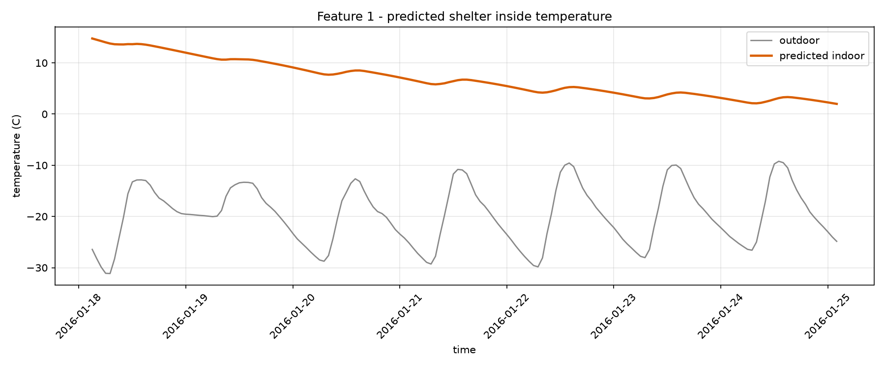
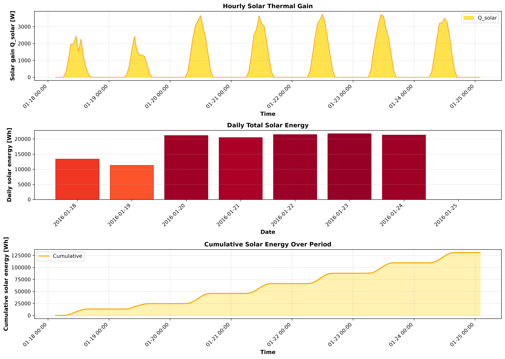
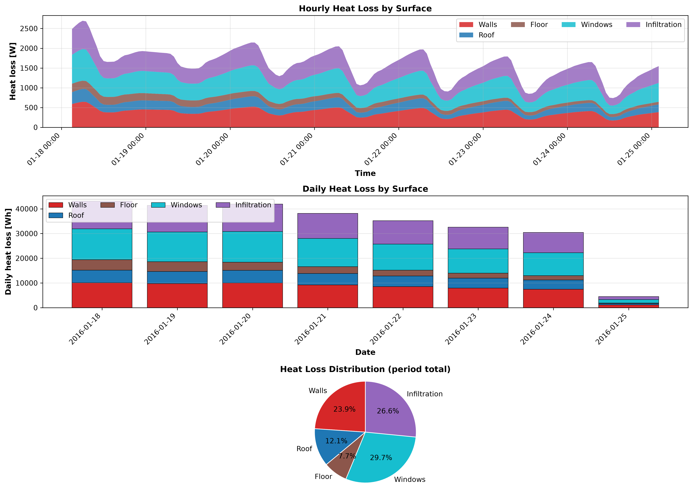
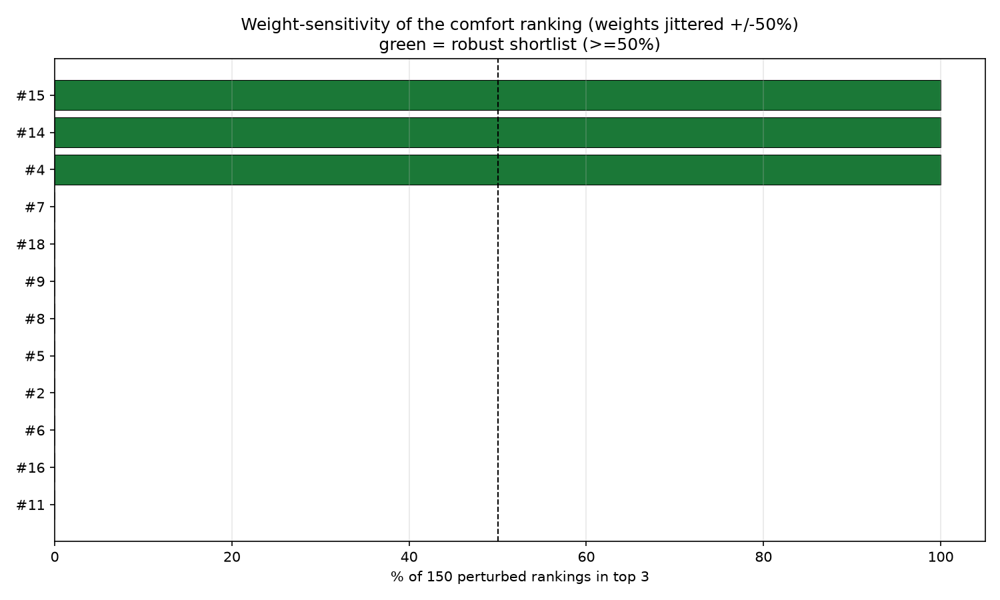
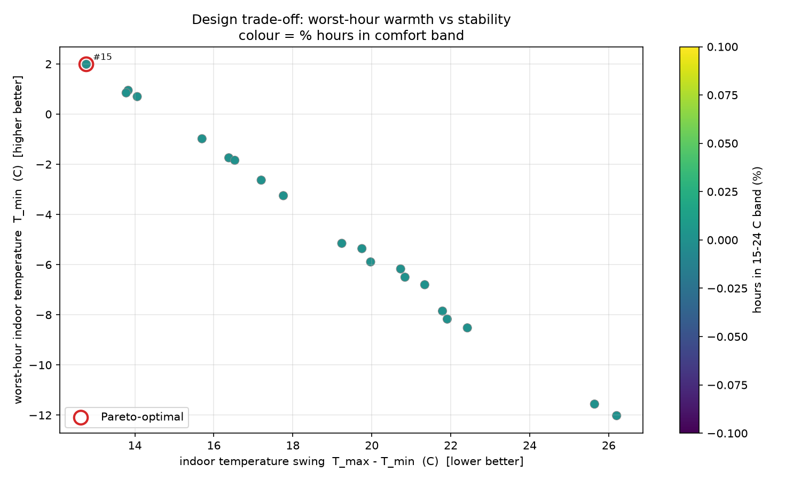

# COCOON shelter pipeline report

_run: `20260909T165132Z`  |  mode: optimize_

## 1. Inputs

- **weather_typical.csv**: 168 h, -31.1 to -9.2 C (mean -19.8 C)
- **weather_worstcase.csv**: 48 h, -39.3 to -16.7 C (mean -28.5 C)
- ground temperature: -3.58 C (10-yr annual-mean air)
- design pool: 20 candidates

## 2. Recommended design: #15

> comfort scores span 9.3 points -> a clear leader; design 15 has the top comfort score (-6.7).

Runner-up: #14

- Geometry: 6.52 x 3.91 x 2.64 m
- Walls: puf (62 mm) + stone_masonry (469 mm)
- Roof: puf (73 mm) + concrete (136 mm)
- Floor: puf (41 mm) + reinforced_concrete (133 mm)
- Windows: 7 x triple (9.8 m2)

- comfort score -6.7, worst-hour T_min 1.99 C, envelope mass 78.83 t

## 3. DRDO feature reports (chosen design)

**Feature 1 - inside temperature:** min 1.99 / mean 6.91 / max 14.76 C over 168 h

**Feature 2 - solar energy:** total 130978.24 Wh (471.522 MJ), peak gain 3730.149 W

**Feature 3 - heat flow:** total loss 267400.109 Wh; walls 23.93% / roof 12.119% / floor 7.702% / windows 29.688% / infiltration 26.562%

## 4. Reliability

- verdict: STABLE: design 15 is rank 1 in >=80% of perturbed rankings -- a single winner is defensible.
- robust shortlist: [15, 14, 4]
- Pareto-optimal: [15]
- top-3 stable across typical vs worst-case weather: True

## 5. ANSYS cross-validation

_not run for this pipeline pass._

