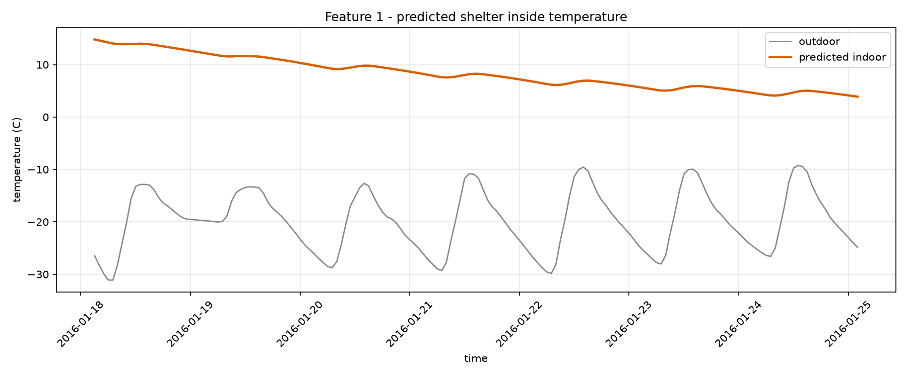
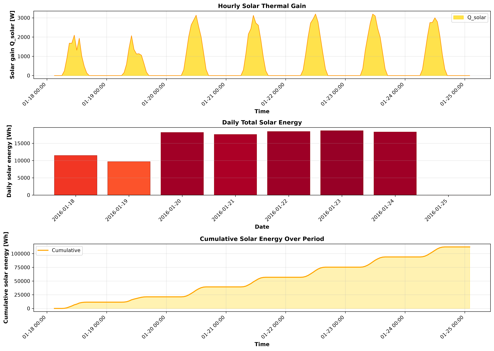
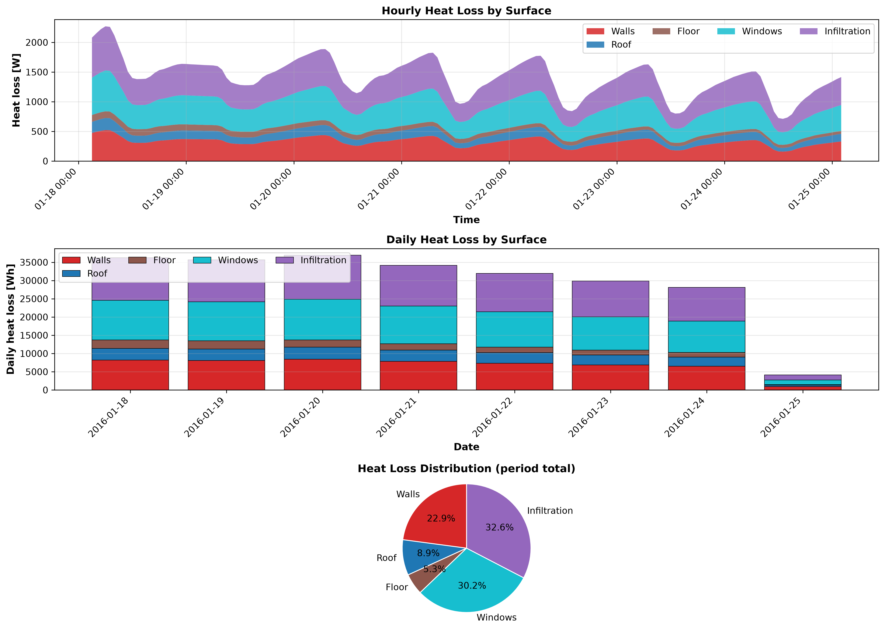
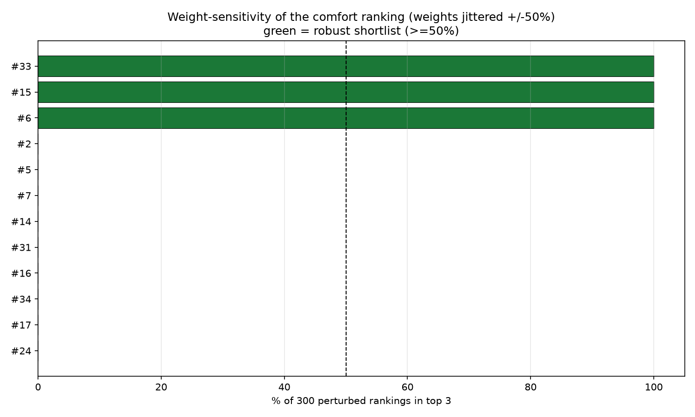
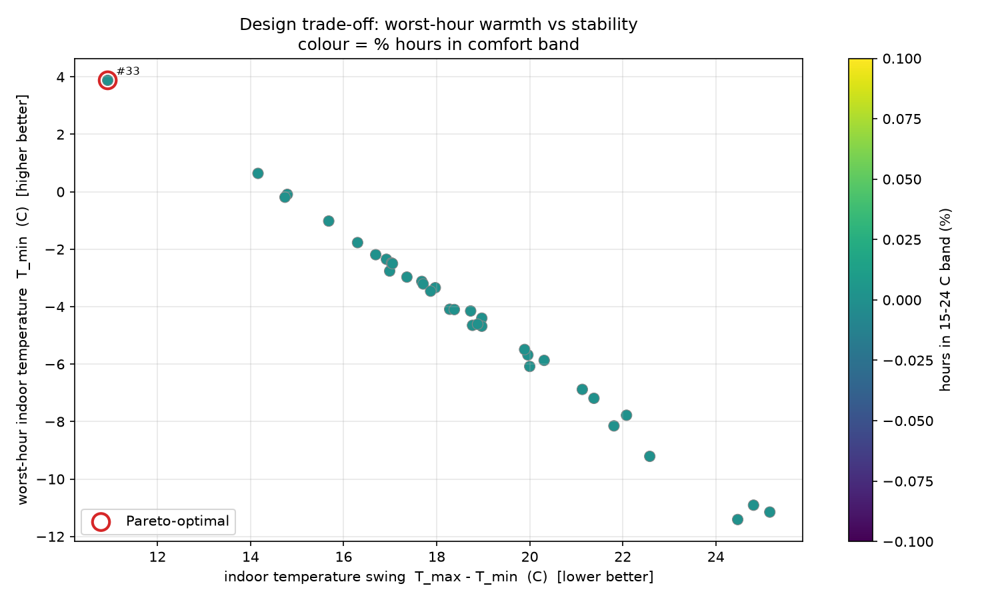

# COCOON shelter pipeline report

_run: `20260909T165448Z`  |  mode: optimize_

## 1. Inputs

- **weather_typical.csv**: 168 h, -31.1 to -9.2 C (mean -19.8 C)
- **weather_worstcase.csv**: 48 h, -39.3 to -16.7 C (mean -28.5 C)
- ground temperature: -3.58 C (10-yr annual-mean air)
- design pool: 35 candidates

## 2. Recommended design: #33

> ANSYS FEM: designs 2.17 C apart, above the 1.19 C model error -> a real difference; design 33 has the top comfort score (8.5).

Runner-up: #15

- Geometry: 6.6 x 3.69 x 2.86 m
- Walls: puf (92 mm) + stone_masonry (516 mm)
- Roof: puf (103 mm) + wood_timber (107 mm)
- Floor: puf (81 mm) + concrete (156 mm)
- Windows: 6 x triple (8.4 m2)

- comfort score 8.5, worst-hour T_min 3.88 C, envelope mass 84.42 t

## 3. DRDO feature reports (chosen design)

**Feature 1 - inside temperature:** min 3.88 / mean 8.33 / max 14.81 C over 168 h

**Feature 2 - solar energy:** total 112267.063 Wh (404.161 MJ), peak gain 3197.271 W

**Feature 3 - heat flow:** total loss 237086.256 Wh; walls 22.889% / roof 8.939% / floor 5.33% / windows 30.209% / infiltration 32.633%

## 4. Reliability

- verdict: STABLE: design 33 is rank 1 in >=80% of perturbed rankings -- a single winner is defensible.
- robust shortlist: [33, 15, 6]
- Pareto-optimal: [33]
- top-3 stable across typical vs worst-case weather: True

## 5. ANSYS cross-validation

|   design_id |   RC_Tmin_C |   ANSYS_Tmin_C |   RC_Tmean_C |   ANSYS_Tmean_C |   RC_Tmax_C |   ANSYS_Tmax_C |   MAE_C |   RMSE_C |     R2 |   RC_rank |   ANSYS_rank |
|------------:|------------:|---------------:|-------------:|----------------:|------------:|---------------:|--------:|---------:|-------:|----------:|-------------:|
|          33 |       11.29 |          14.07 |        13    |           14.97 |       15.01 |          16.64 |   1.193 |    1.481 | -3.019 |         1 |            1 |
|          15 |        9.84 |          11.51 |        12.11 |           12.8  |       14.94 |          15.08 |   0.597 |    0.665 |  0.489 |         2 |            2 |

Design spread 0.89 C vs worst MAE 1.193 C.

