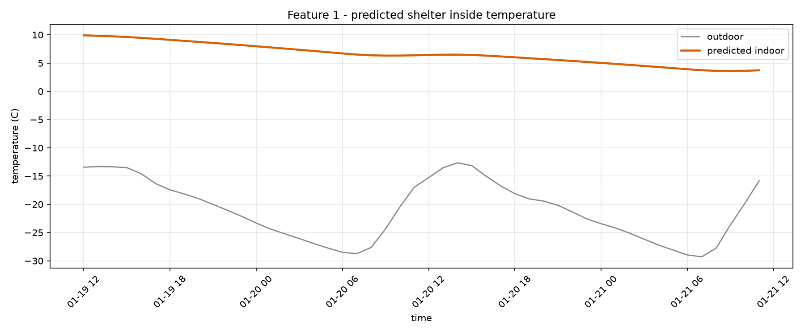
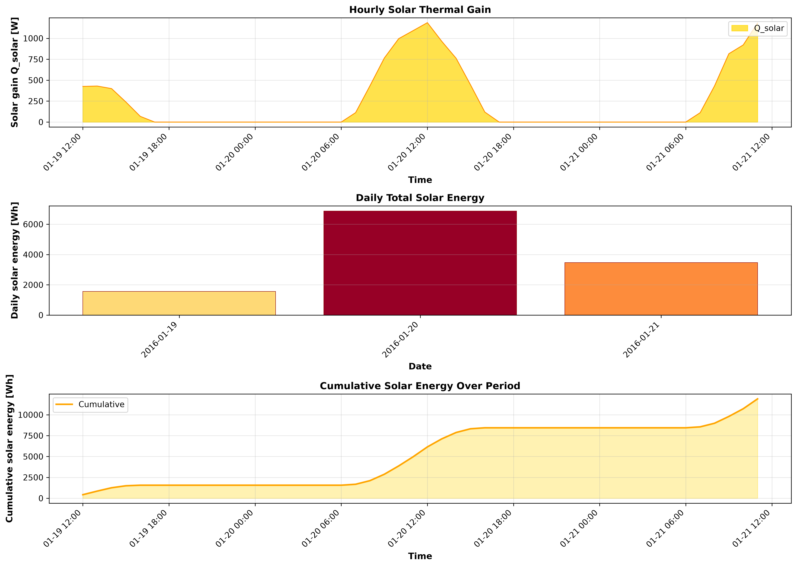
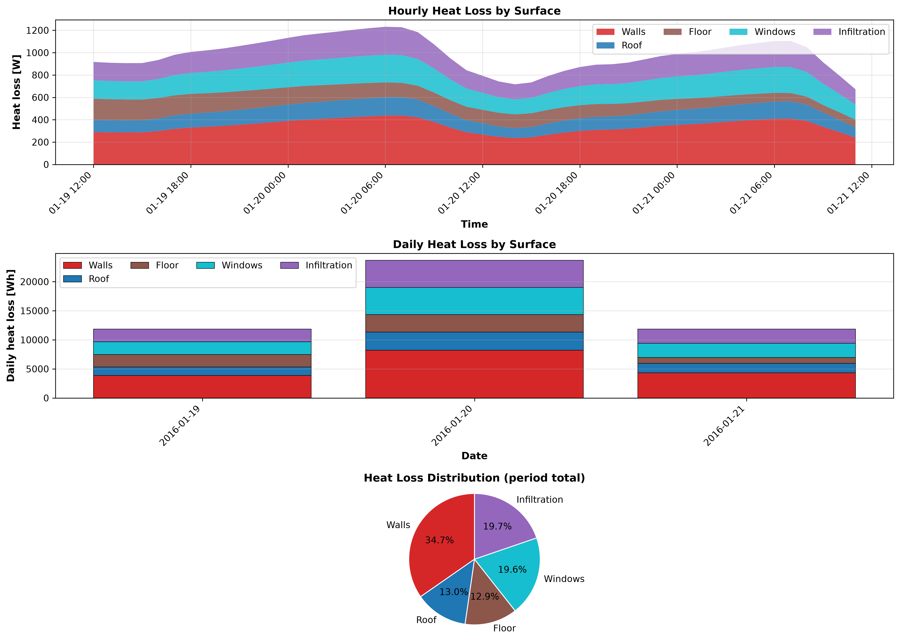

# COCOON shelter pipeline report

_run: `20260909T192930Z-169b`  |  mode: single_

## 1. Inputs

- **weather_typical.csv**: 48 h, -29.3 to -12.6 C (mean -21.0 C)
- **weather_worstcase.csv**: 48 h, -39.3 to -16.7 C (mean -28.5 C)
- ground temperature: -3.58 C (10-yr annual-mean air)

## 2. Recommended design: #single

> Free-running, this envelope holds 3.61-9.91 C indoors over 48 h (0.0% of hours below the 15.0-24.0 C band, 100.0% frost-free). Holding the lower edge needs ~18.5 kWh/day (~2.58 L/day kerosene).

- Geometry: 4.0 x 3.0 x 2.5 m
- Walls: puf (50.0 mm) + stone_masonry (300.0 mm)
- Roof: wood_timber (100.0 mm) + straw_clay (250.0 mm)
- Floor: stone_masonry (300.0 mm)
- Windows: - x double (2.5 m2)

- comfort score None, worst-hour T_min None C, envelope mass None t

## 3. DRDO feature reports (chosen design)

**Feature 1 - inside temperature:** min 3.61 / mean 6.56 / max 9.91 C over 48 h

**Feature 2 - solar energy:** total 11900.0 Wh (42.84 MJ), peak gain 1187.0 W

**Feature 3 - heat flow:** total loss 47403.0 Wh; walls None% / roof None% / floor None% / windows None% / infiltration None%

## 5. ANSYS cross-validation

_not run for this pipeline pass._

