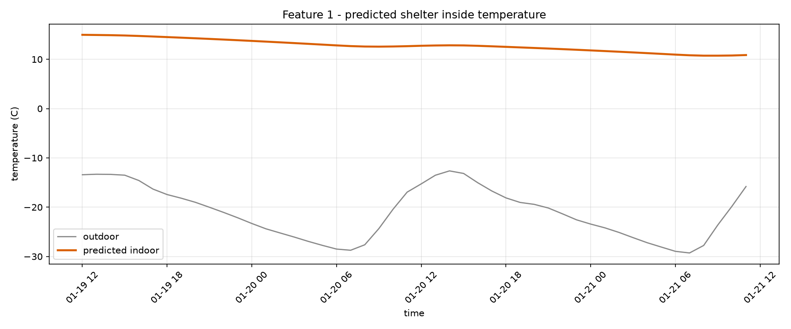
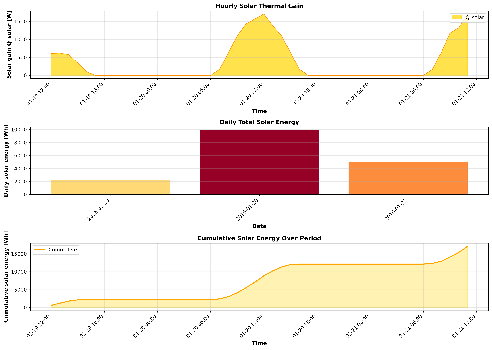
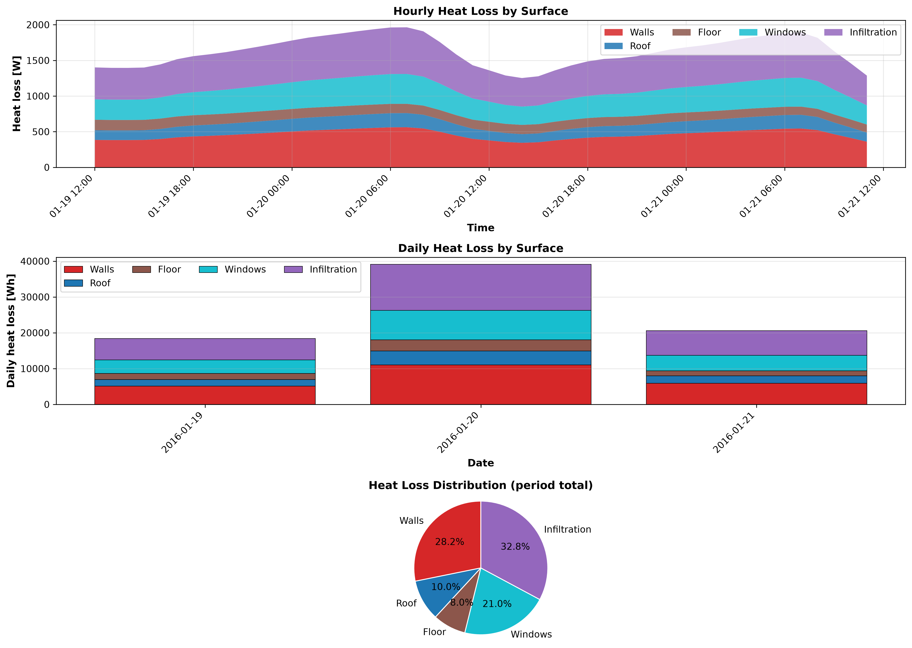

# COCOON shelter pipeline report

_run: `20260909T193307Z-623e`  |  mode: single_

## 1. Inputs

- **weather_typical.csv**: 48 h, -29.3 to -12.6 C (mean -21.0 C)
- **weather_worstcase.csv**: 48 h, -39.3 to -16.7 C (mean -28.5 C)
- ground temperature: -3.58 C (10-yr annual-mean air)

## 2. Recommended design: #single

> Free-running, this envelope holds 10.73-14.96 C indoors over 48 h (0.0% of hours below the 15.0-24.0 C band, 100.0% frost-free). Holding the lower edge needs ~31.0 kWh/day (~4.3 L/day kerosene).

- Geometry: 6.0 x 4.0 x 2.8 m
- Walls: puf (80.0 mm) + stone_masonry (400.0 mm)
- Roof: puf (90.0 mm) + wood_timber (120.0 mm)
- Floor: puf (60.0 mm) + concrete (150.0 mm)
- Windows: - x double (3.6 m2)

- comfort score None, worst-hour T_min None C, envelope mass None t

## 3. DRDO feature reports (chosen design)

**Feature 1 - inside temperature:** min 10.73 / mean 12.79 / max 14.96 C over 48 h

**Feature 2 - solar energy:** total 17136.0 Wh (61.69 MJ), peak gain 1709.3 W

**Feature 3 - heat flow:** total loss 78072.0 Wh; walls None% / roof None% / floor None% / windows None% / infiltration None%

## 5. ANSYS cross-validation

_not run for this pipeline pass._

