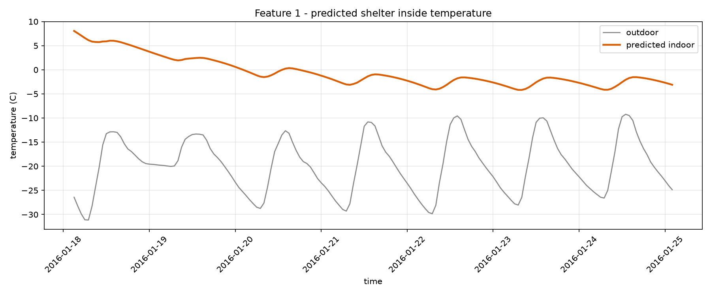
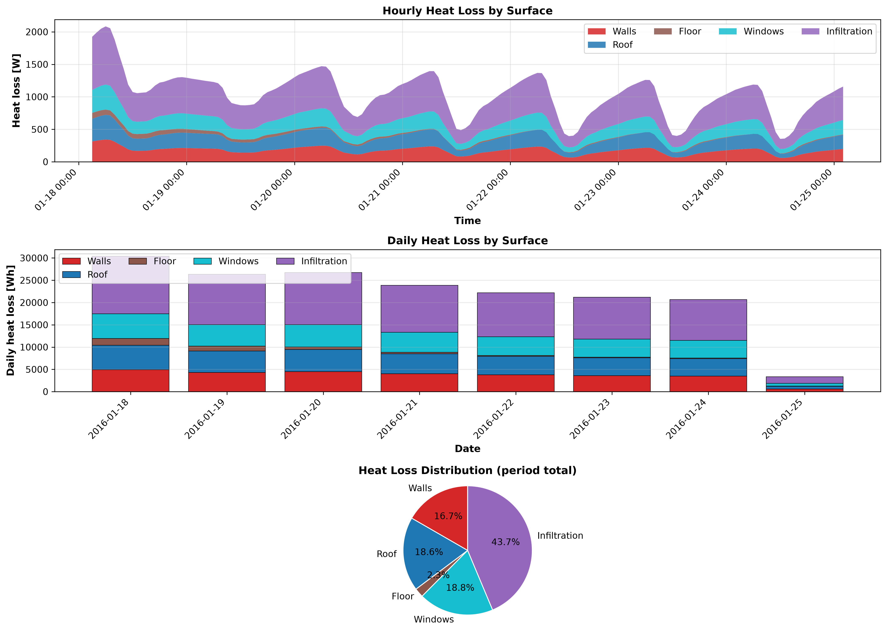

# COCOON shelter pipeline report

_run: `20260909T195801Z-7011`  |  mode: single_

## 1. Inputs

- **weather_typical.csv**: 168 h, -31.1 to -9.2 C (mean -19.8 C)
- **weather_worstcase.csv**: 48 h, -39.3 to -16.7 C (mean -28.5 C)
- ground temperature: -3.58 C (10-yr annual-mean air)

## 2. Recommended design: #single

> Free-running, this envelope holds -4.17-8.05 C indoors over 168 h (0.0% of hours below the 15.0-24.0 C band, 31.0% frost-free). Holding the lower edge needs ~19.5 kWh/day (~2.71 L/day kerosene).

- Geometry: 8.0 x 5.0 x 2.5 m
- Walls: puf (80.0 mm) + straw_clay (600.0 mm)
- Roof: puf (80.0 mm) + rammed_earth (250.0 mm)
- Floor: puf (80.0 mm) + straw_clay (300.0 mm)
- Windows: - x double (3.6 m2)

- comfort score None, worst-hour T_min None C, envelope mass None t

## 3. DRDO feature reports (chosen design)

**Feature 1 - inside temperature:** min -4.17 / mean -0.49 / max 8.05 C over 168 h

**Feature 2 - solar energy:** total 61236.6 Wh (220.45 MJ), peak gain 1744.0 W

**Feature 3 - heat flow:** total loss 174736.0 Wh; walls None% / roof None% / floor None% / windows None% / infiltration None%

## 5. ANSYS cross-validation

_not run for this pipeline pass._

