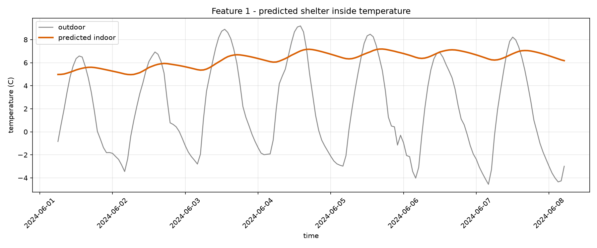
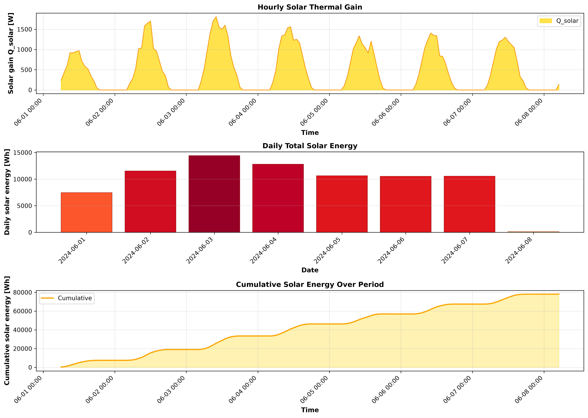
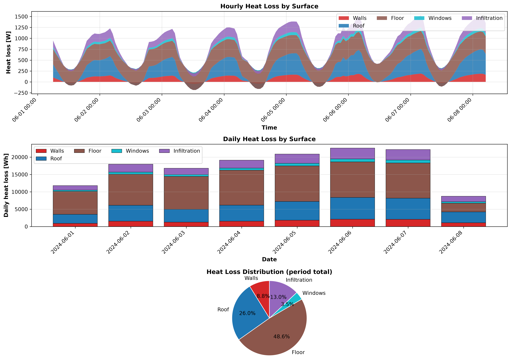

# COCOON shelter pipeline report

_run: `20260909T200313Z-45a3`  |  mode: single_

## 1. Inputs

- **weather_typical.csv**: 168 h, -4.6 to 9.2 C (mean 2.1 C)
- **weather_worstcase.csv**: 37 h, -39.3 to -16.7 C (mean -30.6 C)
- ground temperature: -3.58 C (10-yr annual-mean air)

## 2. Recommended design: #single

> Free-running, this envelope holds 4.96-7.19 C indoors over 168 h (0.0% of hours below the 15.0-24.0 C band, 100.0% frost-free). Holding the lower edge needs ~15.2 kWh/day (~2.11 L/day kerosene).

- Geometry: 7.0 x 4.5 x 3.5 m
- Walls: puf (80.0 mm) + rammed_earth (600.0 mm)
- Roof: stone_masonry (250.0 mm)
- Floor: concrete (300.0 mm)
- Windows: - x double (2.52 m2)

- comfort score None, worst-hour T_min None C, envelope mass None t

## 3. DRDO feature reports (chosen design)

**Feature 1 - inside temperature:** min 4.96 / mean 6.29 / max 7.19 C over 168 h

**Feature 2 - solar energy:** total 78161.5 Wh (281.38 MJ), peak gain 1810.8 W

**Feature 3 - heat flow:** total loss 140108.0 Wh; walls None% / roof None% / floor None% / windows None% / infiltration None%

## 5. ANSYS cross-validation

_not run for this pipeline pass._

