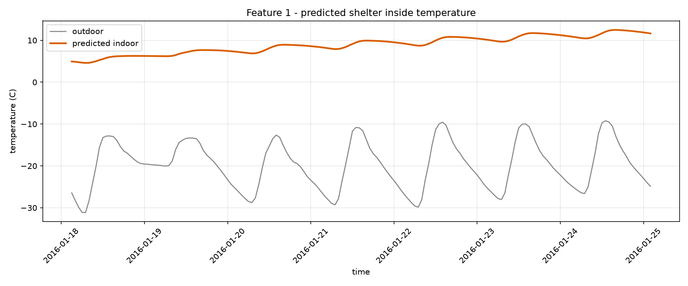
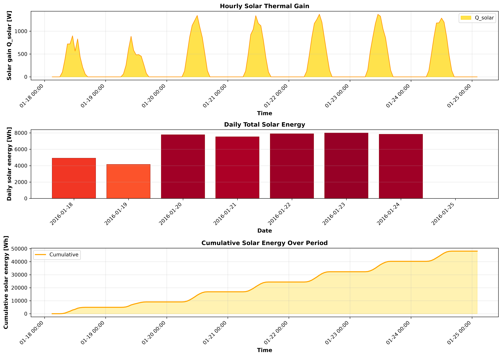
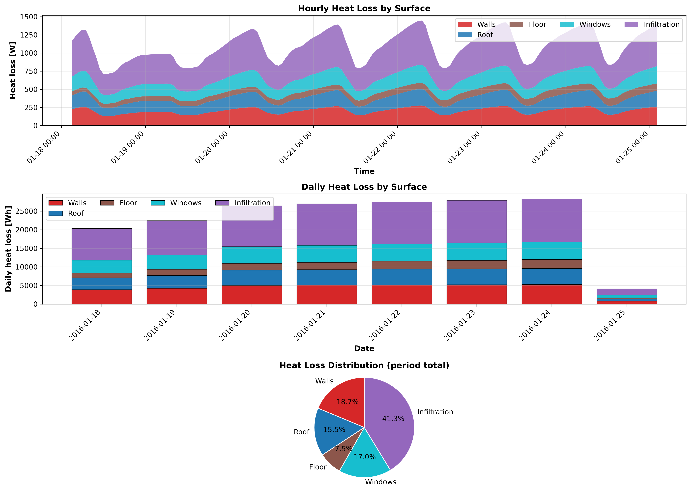
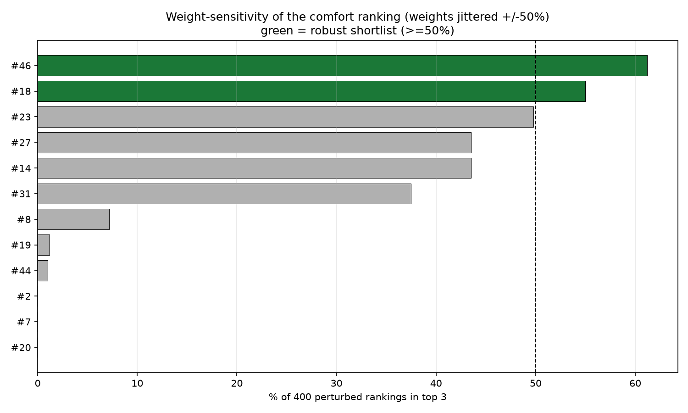
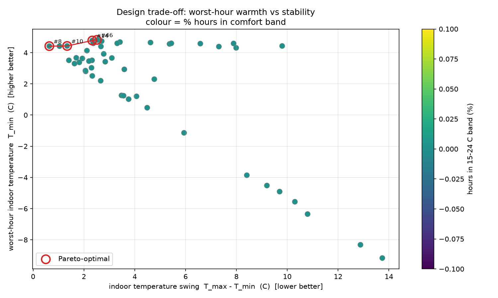

# COCOON shelter pipeline report

_run: `20260909T215030Z-48ef`  |  mode: optimize_

## 1. Inputs

- **weather_typical.csv**: 168 h, -31.1 to -9.2 C (mean -19.8 C)
- **weather_worstcase.csv**: 48 h, -39.3 to -16.7 C (mean -28.5 C)
- ground temperature: -3.58 C (10-yr annual-mean air)
- design pool: 50 candidates

## 2. Recommended design: #18

> comfort scores span only 0.1 points across the shortlist -> treated as a tie; tie broken on logistics: design 18 is the lightest (67.68 t) with transportability 4.7/5.

Runner-up: #46

- Geometry: 6.0 x 4.0 x 2.8 m
- Walls: puf (90 mm) + adobe (420 mm)
- Roof: puf (62 mm) + wood_timber (139 mm)
- Floor: puf (76 mm) + stone_masonry (229 mm)
- Windows: 2 x triple (3.6 m2)

- comfort score 19.3, worst-hour T_min 4.59 C, envelope mass 67.68 t

## 3. DRDO feature reports (chosen design)

**Feature 1 - inside temperature:** min 4.59 / mean 8.92 / max 12.48 C over 168 h

**Feature 2 - solar energy:** total 48114.5 Wh (173.21 MJ), peak gain 1370.3 W

**Feature 3 - heat flow:** total loss 183950.0 Wh; walls None% / roof None% / floor None% / windows None% / infiltration None%

## 4. Reliability

- verdict: NOT a clean single winner: the top spot moves under weight perturbation. Report the robust shortlist [46, 18] instead of one design.
- robust shortlist: [46, 18]
- Pareto-optimal: [46, 14, 10, 8]
- top-3 stable across typical vs worst-case weather: False

## 5. ANSYS cross-validation

_not run for this pipeline pass._

