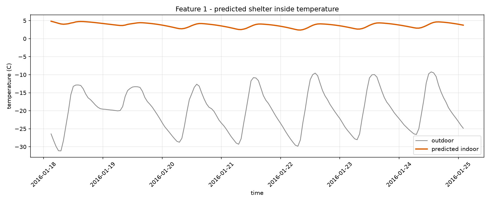
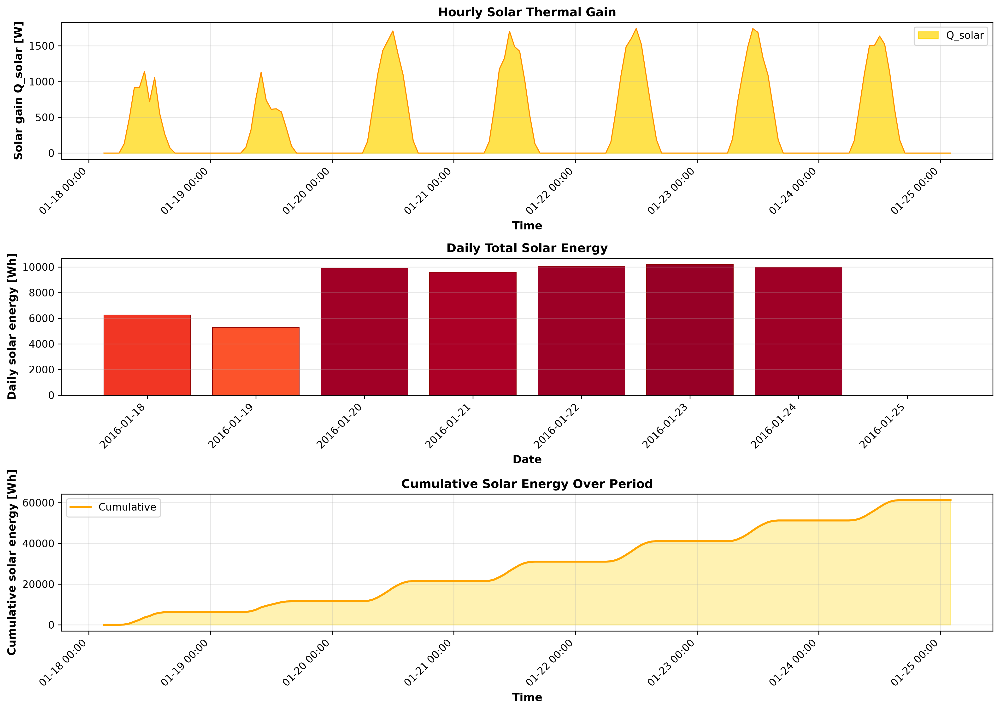
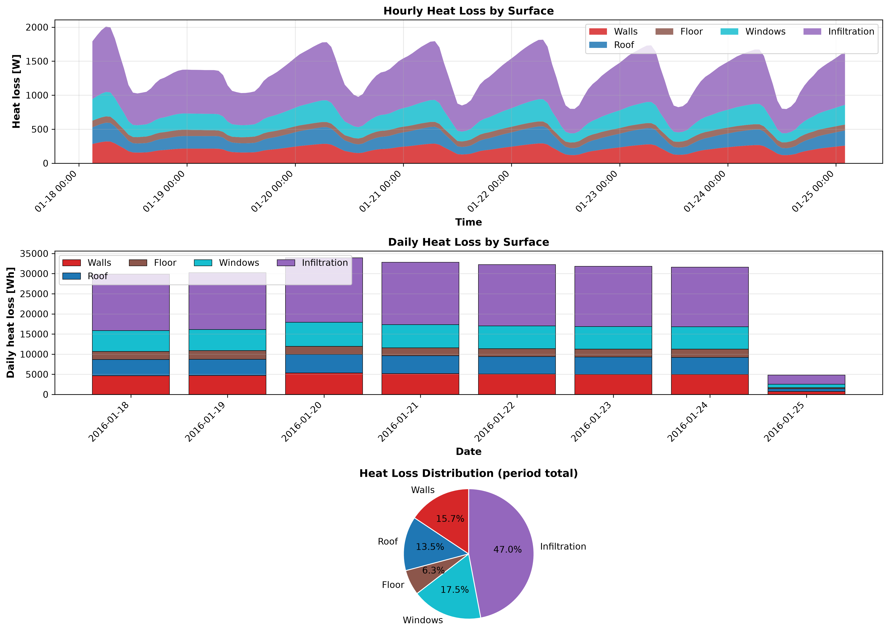
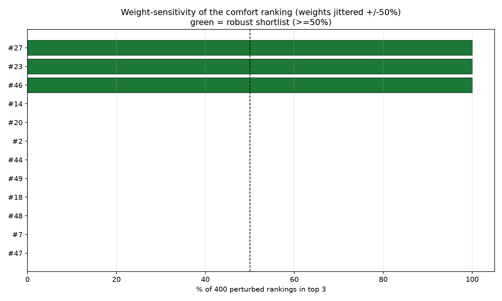
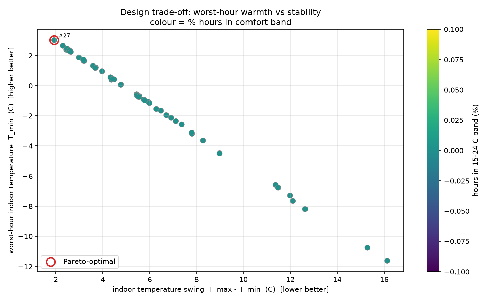

# COCOON shelter pipeline report

_run: `20260910T040753Z-9c44`  |  mode: optimize_

## 1. Inputs

- **weather_typical.csv**: 168 h, -31.1 to -9.2 C (mean -19.8 C)
- **weather_worstcase.csv**: 48 h, -39.3 to -16.7 C (mean -28.5 C)
- ground temperature: -3.58 C (10-yr annual-mean air)
- design pool: 50 candidates

## 2. Recommended design: #23

> comfort scores span only 2.7 points across the shortlist -> treated as a tie; tie broken on logistics: design 23 is the lightest (93.47 t) with transportability 4.27/5.

Runner-up: #46

- Geometry: 8.0 x 6.0 x 2.4 m
- Walls: puf (78 mm) + adobe (449 mm)
- Roof: puf (107 mm) + wood_timber (184 mm)
- Floor: puf (89 mm) + reinforced_concrete (198 mm)
- Windows: 2 x double (3.6 m2)

- comfort score 3.5, worst-hour T_min 2.39 C, envelope mass 93.47 t

## 3. DRDO feature reports (chosen design)

**Feature 1 - inside temperature:** min 2.39 / mean 3.75 / max 4.84 C over 168 h

**Feature 2 - solar energy:** total 61236.6 Wh (220.45 MJ), peak gain 1744.0 W

**Feature 3 - heat flow:** total loss 227315.0 Wh; walls None% / roof None% / floor None% / windows None% / infiltration None%

## 4. Reliability

- verdict: STABLE: design 27 is rank 1 in >=80% of perturbed rankings -- a single winner is defensible.
- robust shortlist: [27, 23, 46]
- Pareto-optimal: [27]
- top-3 stable across typical vs worst-case weather: False

## 5. ANSYS cross-validation

_not run for this pipeline pass._

